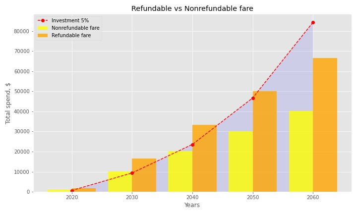

# Insurance plans comparison

It's my **very first project**. I tried to use as many different functions as possible just for practice. So, sometimes it could be not very logical structurally but it was useful for me to remember them :)

Idea of this project - is a **real-life task**. I should choose a "critical illness insurance" plan for my family.
There are two possibilities:
1. Paying less - **84$** monthly for both adults. Fare will be fixed till 75 years old.
2. Paying more - **139$** monthly, but at 75 years old, if you didn't use insurance, you'll receive all paied money back.

Which plan to choose? It seams like a good option to choose the second one. Or you will use it or everything you paid will be reimbursed. Let investigate it.

## Inflation influence
My first concern was which insurance protection to choose: $30K or $50K. I investigate inflation influence.

Total amount paid for $50K insurance plan with nonrefundable fare during 40 years is about $40K. If we take into account **inflation of 3%**(average inflation rate in Canada for the last years), we can see on the chart that in 20 years value will start decrease significantly and in the end of the period will devaluate twice. The same will be with insurance value that you can achive in case of illness.
 

**Conclusion:** $30K will be really not significant amount in 20 years. So, I'll investigate $50K. Also, it's a good idea to upgrade insurance plan in year 2040.

## Investment of fare difference
Fare **difference is $55** per month. What if I make money work for me?
Let see when investment of 3% or 5% will help me to cover all amount spend for insurance:

You can see on chart that paid-off year will be:
- **2051** in case of investment for 3%
- **2039** in case of investment for 5%

**Conclusion:** If we take nonrefundable fare and make investment of fare difference we will receive our money back earlier than the end of insurance period. 

## Total spend and receive

Total spend for refundable and nonrefundable fare vs investment of fare difference chart:

|total, nonrefundable fare | total, refundable fare | investment 5pct |
|:------------------------:|:----------------------:|:---------------:|
|$40 320                   |$66 720                 |$185 855         |

**Conclusion:** In case insurance wasn't used, in 40 years (end of insurance period) you will receive your money back:
| Nonrefundable fare | Refundable fare | Nonrefundable fare + investment|
|-------------------:|----------------:|-------------------------------:|
|                  $0|          $66 720|                        $145 535|
